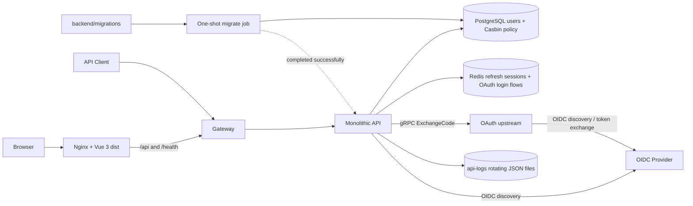
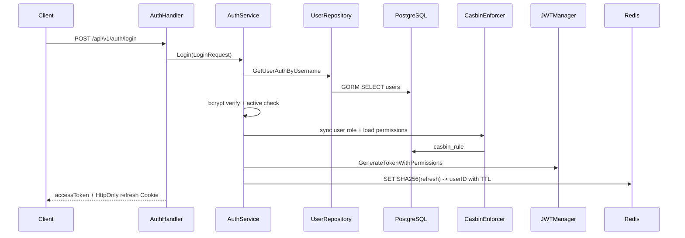
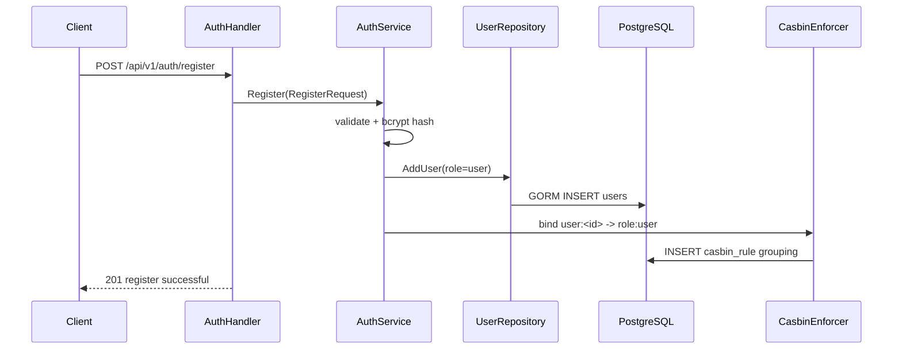
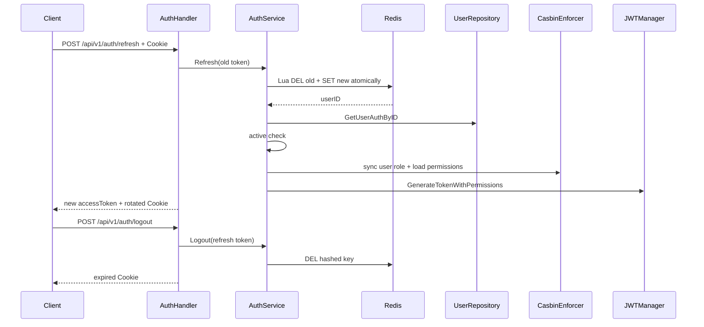

# AI Gateway Go V2 Architecture

本文描述仓库当前实际架构。Go module 位于 `backend/`，参考 `D:/vue-element-plus-admin/backend` 的模块化分层，Auth/User 等模块装配到 API 进程，OAuth token 兑换由独立 upstream gRPC 进程承担；数据库 Repository 使用 GORM。

## 1. 运行拓扑



`backend/docker-compose.yml` 定义名为 `ai-gateway-go-auth` 的本地 Stack，包含 API、upstream、PostgreSQL、Redis、migration、Gateway 与 Web 容器。Gateway 是无状态单上游代理，不持有身份或业务数据；`migrate` 是一次性 schema job；API 的轮转文件日志保存在 `api-logs` named volume。Web 容器等待 Gateway healthy 后启动，并把宿主机 `WEB_PORT` 绑定到容器 `8080`。Compose 显式读取仓库根 `.env`；后端构建上下文与 migration 挂载路径相对于 `backend/`，Web 构建上下文是同级 `frontend/`。后端 Dockerfile 还提供继承 `migrate/migrate` 且携带版本化 SQL 的 `migrations` 发布 target。upstream 以独立 gRPC 进程提供 token 兑换与 health 服务，50051 仅在 Compose 内部暴露；当前没有 K8s 配置、服务发现或 JWKS。API 保留可选的 OIDC Authorization Code + PKCE 登录骨架。

`frontend/` 是与 `backend/` 同级的独立 Vue 3 + Vite 单页管理界面。开发服务器把 `/api`、`/health` 与 `/oai` 代理到 `127.0.0.1:8080`；生产镜像以 Node.js stage 执行 `npm ci`/`npm run build`，再由 Nginx 在 `8080` 提供 `dist`。Nginx 对普通页面使用 `try_files` 回退到 `index.html`，对指纹化 `/assets/` 使用长期缓存，并把 `/api/`、`/health/`、`/oai/` 同源代理到 `gateway:8080`；API 代理关闭响应缓冲并放宽读取超时，为后续流式响应保留传输边界。前端通过 `frontend/src/axios/` 下的共享 Axios 模块消费后端公开 HTTP 合同，不直接访问 PostgreSQL 或 Redis。

## 2. 后端分层

```text
backend/cmd/api
  -> internal/logger
  -> gin.Engine.Run
  -> internal/router.AuthRouter / UserRouter
       -> modules/auth/routes -> handler -> service
       -> modules/user/routes -> handler -> service -> repository
       -> middleware/jwt
       -> middleware/casbin
       -> middleware/httpserver
  -> internal/router.OauthRouter
       -> modules/oauth/routes -> handler -> service -> oidc
       -> middleware/redis
       -> directory/upstream -> rpc/upstream -> upstreamserver -> external OIDC provider
backend/cmd/upstream
  -> config / logger / provider discovery
  -> upstreamserver.Serve (gRPC + health + graceful shutdown)
  -> database/connect
  -> middleware/redis
```

启动约定对齐 `vue-element-plus-admin/backend/cmd/api/main.go`：

- Compose 先等待 PostgreSQL healthy，再执行全部未应用的 SQL migration；只有 `migrate` 成功退出后才启动 API；
- `cmd/api/main.go` 只编排进程生命周期：先初始化 JSON logger 并预检日志文件，再由 `config.go` 加载运行配置和可选 OAI OIDC 配置，由 `instances.go` 连接已迁移的 PostgreSQL/Redis 并创建 Repository、Casbin、JWT、OIDC 及 upstream connection/directory 等实例；`bootstrap.go` 负责初始用户，`health.go` 负责健康检查，`routes.go` 负责 Gin、中间件和业务路由注册，最后由 `main.go` 调用 `router.Run(HTTP_ADDR)`；
- API 直接通过 Gin Engine 的 `router.Run(HTTP_ADDR)` 启动；Gateway 仍使用标准库 `http.Server` 承担反向代理；
- Handler 不在 `main` 创建，由 `internal/router` 组装 `NewService`、`New*Handler` 并调用模块 `Register*Routes`。

职责边界：

- Router：总路由和模块路由装配，并在此创建 Handler；
- Handler：JSON/Cookie/Gin Context 与 HTTP 状态；
- Service：登录、refresh 轮换、logout、用户状态规则；
- Repository：全部 GORM 用户表访问；
- JWT Middleware：Bearer token 验证和 Context 身份；
- Casbin Middleware：GORM policy persistence、用户角色同步和有效权限计算；
- Redis Middleware：refresh token 建立、原子轮换和删除；
- OAuth/OIDC：通用 Handler/Service 负责一次性 state、PKCE、回调和 token exchange 编排；Service 定义 TokenExchanger 接口，directory 实现远程兑换适配；provider 包负责 discovery 后的 OAuth 配置与授权 URL 参数；
- DTO：HTTP 合同，与 GORM model 分离。

依赖接口遵循使用方定义原则：Repository 是具体的 GORM 实现，Auth/User Service 直接依赖 `*user.Repository`；需要隔离 HTTP 层时，由 Handler 定义最小 Service 接口，例如 `CurrentUserService`。Repository 文件不声明只为测试替身服务的接口。

Auth 与 User 的分层不产生进程间网络调用，均位于同一 `cmd/api` 进程内；启用 OIDC 时，API 启动阶段会向 issuer 执行 discovery，回调阶段经 directory 和 gRPC 调用 upstream，由 upstream 请求 token endpoint；upstream 自己也在启动阶段执行 discovery。

## 3. OIDC OAuth 登录骨架

当一组 `OAI_ISSUER`、`OAI_CLIENT_ID`、`OAI_REDIRECT_URL` 配置存在时，API 在 `OIDC_DISCOVERY_TIMEOUT` 内通过 issuer 的 `/.well-known/openid-configuration` 发现授权与 token endpoint，并注册：

```text
GET /oai/login
GET /oai/callback
```

`/oai/login` 生成 256-bit 随机 `state` 与 PKCE verifier，把流程数据以 `oidc:flow:<state>` 写入 Redis，TTL 为 5 分钟，然后携带 S256 challenge 及 OpenAI 授权参数跳转到 provider。`/oai/callback` 通过 Redis `GETDEL` 原子消费 state，区分无效 state 与 Redis 故障，校验本地过期时间后经注入的 TokenExchanger 使用同一 verifier 远程兑换 token。随机 state 是流程的唯一键，不依赖 provider ID；同一通用 Handler/Service 可以配合不同 OIDC 配置和路由组复用，但当前启动装配只注册 OAI。

directory 用有界 context 传递 code/verifier/provider，将 token 的 access token、refresh token、token type 和 expiry 映射回 oauth2.Token。server 校验参数与 provider 是否启用，并映射错误；错误合同、mTLS 配置及无重试约定见 `docs/upstream.md`。RefreshToken RPC 尚未实现。

当前 `SaveToken` 仍为空实现，成功回调后的应用跳转、nonce、ID token 验证和持久化均未实现；OAI scopes 目前为空，因此这只是可校验的流程骨架，尚不能视为完整可用的 OpenAI 登录。

## 4. 登录调用链



不存在的用户仍执行 dummy bcrypt。Redis 不存储或暴露原始 refresh token，只保存 `refresh_token:<sha256>` key。

浏览器端由 Vue Router 保护首页路由。登录页调用 `/api/v1/auth/login`，根据“记住登录状态”把 access token 保存到 `localStorage` 或 `sessionStorage`，refresh token 始终仅存在于后端设置的 HttpOnly Cookie 中。`src/axios/config.js` 定义默认拦截器，`service.js` 持有业务请求与刷新请求两个 Axios 实例，`index.js` 提供统一请求入口。请求拦截器统一注入 Bearer access token；响应拦截器遇到 `401` 时调用 `/api/v1/auth/refresh` 轮换 Cookie 并重试原请求一次。并发 `401` 共享同一个 refresh Promise，避免重复轮换导致旧 refresh token 重放失败；刷新失败则清理 access token 并返回登录页。前端不读取 refresh token。

## 5. 注册调用链



客户端必须提交 `username`、`password`、`check_password`、非空 `code` 和 `iAgree=true`。用户名为 3–50 个字符，密码为 8–72 字节；客户端不能指定角色，所有注册用户固定为 `user`。当前验证码只复用原后端的“非空检查”阶段，没有验证码发送或真实性校验服务。

Vue 登录页提供“创建账号”入口并导航到 `/register`。注册页在客户端先检查用户名长度、密码长度与一致性、非空注册码及使用确认，再调用注册接口；`201` 成功后不建立登录会话，而是返回 `/login`、回填新用户名并显示成功提示。`400` 和 `409` 分别映射为表单校验与用户名重复反馈。

## 6. Refresh 与 logout



规则：

- refresh token 是 32 字节安全随机值，以 Base64URL 传输；
- Cookie 为 HttpOnly、SameSite=Lax，Path 为 `/api/v1/auth`；
- `COOKIE_SECURE` 控制 Secure 属性，HTTPS 环境必须开启；
- rotation 使用 Redis Lua 原子完成，旧 token 只能成功使用一次；
- 无 Cookie 的 logout 视为已经注销，幂等返回成功；
- 用户删除或禁用后 refresh 失败；
- refresh token 状态不放入 PostgreSQL。

## 7. Access JWT 与当前用户

- 同一 API 使用本地 HMAC 密钥签发和验证 HS256 access token；
- `JWT_SECRET` 必须由根 `.env` 提供，代码和 Compose 都不提供开发默认密钥；
- 校验 issuer、audience、iat、exp、sub；
- claims 包含用户名、Casbin 角色和有效 permissions；
- 不提供 JWKS；
- `/users/me` 和 `/auth/verify` 经 JwtFilter 后，通过 User Service/Repository 回查 PostgreSQL，再由 Casbin 返回有效角色和权限。

当前 Casbin 模型是最小 RBAC：用户 subject 为 `user:<id>`，角色 subject 为 `role:<code>`。仅支持 `user`、`admin`、`test`，三者都只有 `dashboard:view` 权限；暂不提供角色或策略管理 API。

## 8. 日志、数据和 readiness

API 使用 `log/slog` JSON handler，同时写标准输出和 lumberjack 轮转文件。`LOG_FILE` 为空时使用 `./logs/backend/app.log`；不提交的根 `.env` 为 Compose 设置 `/var/log/ai-gateway/app.log`，Compose 也为缺省场景提供同一路径，该目录由镜像以 UID `65532` 创建，并挂载到 `api-logs` named volume。可提交的 `.env.example` 不保存本地日志路径。单文件上限 100 MB，最多保留 10 个备份和 30 天，旧文件启用压缩。启动时无法创建或打开日志文件会终止进程；运行期间文件 sink 写入失败会报告到标准错误，标准输出日志仍继续。API 将该 logger 设为全局默认值，HTTP access/recovery 也复用同一实例。

PostgreSQL 当前包含最小 `users` 表：

```text
id, username, password_hash, role_code, is_active, created_at, updated_at
```

数据库结构只由 `backend/migrations` 管理：`000001_users` 创建用户表，`000002_casbin_rbac` 创建 `casbin_rule` 并写入三角色首页策略；migrate 工具在 `schema_migrations` 记录当前版本和 dirty 状态。生产 API 与 Casbin GORM Adapter 都关闭自动迁移，初始化管理员仍使用 `FirstOrCreate`。测试可在隔离的内存 SQLite 上使用 `AutoMigrate`，不影响生产 schema 流程。API readiness 检查 PostgreSQL `PingContext` 和 Redis `PING`；OAuth 启用时额外在 1s 内检查 upstream.UpstreamService 的 gRPC health；任一依赖不可用即返回 `503`。`cmd/healthcheck` 是 distroless 容器内的探测客户端，它请求 API `main` 暴露的 `/health/ready` 端点；两者分别承担探测方和被探测方职责。Gateway 容器使用同一客户端，经反向代理检查 API readiness。

## 9. 仓库和部署边界

```text
repository root
├─ .env / .env.example
├─ backend/         # Go module + Dockerfile + docker-compose.yml + migrations
├─ frontend/        # Vue 3 + Vite source + Node/Nginx production image
└─ docs/deployment.md
```

Compose 文件位于 `backend/`；API/Gateway build context 是当前后端目录，Web build context 是 `../frontend`，migration job 只读挂载 `./migrations`，API/upstream 日志分别挂载 `api-logs` / `upstream-logs` named volume。根 `.env` 由命令行 `--env-file` 显式传入；后端目录不放 `.env`。默认本地容器入口为 `127.0.0.1:${WEB_PORT:-8088}`，Nginx 静态服务与代理保持浏览器请求同源；Gateway 的 `127.0.0.1:${APP_PORT:-8080}` 仍保留给 API 调试。`.scripts/update-database.sh` 使用该 Compose 文件启动 PostgreSQL 并运行既有 migrate job；`.scripts/start.sh` 使用同一入口启动整个容器 Stack，同时以前台 Vite 提供开发热更新，`Ctrl+C` 只终止 Vite，不停止容器。

公开仓库只保存软件本身和通用运行能力：`ci.yml` 验证 Go/Vue 与全部镜像 target，`release.yml` 在 `main`、`v*` tag 或手动运行时，把 API、Gateway、Upstream、Migrations、Web 五个同版本镜像发布到 GHCR，并始终附加完整源码 SHA 标签。生产 Compose、服务器地址和 CD 位于私有 `DWHuang99/erent-deploy`；其 `workflow_dispatch` 接受不可变镜像标签，SSH 到服务器后拉取私有部署仓库和四个镜像，等待 migration 与整套服务 healthy。公开仓库没有生产 Secrets、生产 Compose 或自动触发生产部署；upstream 的新服务器环境变量、CD 和 GitHub Environment 等服务器确定后再在私有仓库接入。详细边界见 `docs/deployment.md` 和 `docs/upstream.md`。

## 10. 当前能力边界

- 已实现：Vue 3 登录页与受保护首页、登录后跳转、access token 会话恢复、自动 refresh 重试、退出登录、响应式导航和明暗主题；Node/Nginx 多阶段生产镜像提供 SPA 回退、静态资源缓存及同源 API/readiness 代理；
- 已实现：后端注册、登录、access JWT、Redis refresh rotation、logout、当前用户、初始化管理员、Casbin 三角色首页权限、readiness；
- 已实现：可选 OIDC discovery、一次性 Redis state、Authorization Code + PKCE、通用 OAuth Handler/Service、OAI 路由、directory 与 upstream gRPC 兑换、mTLS、健康检查和本地容器；
- 未实现：OAuth scopes、token 持久化、登录完成跳转、nonce 与 ID token 验证，以及除 OAI 外的 provider 启动装配；
- 未实现：真实验证码服务、改密、多设备会话管理、角色/策略管理、细粒度业务权限、审计；
- 未实现：Provider、模型目录、Chat Completions、SSE、WebSocket；
- 未实现：API Key、限流、用量、钱包和计费。
