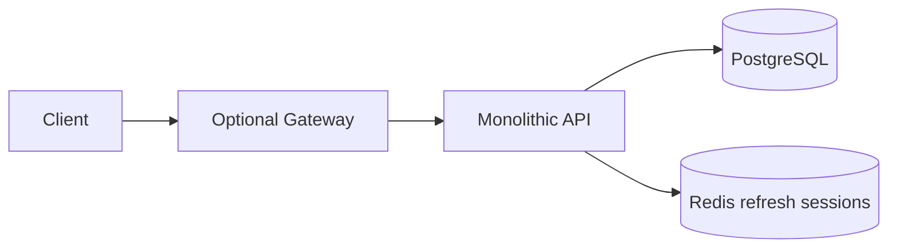
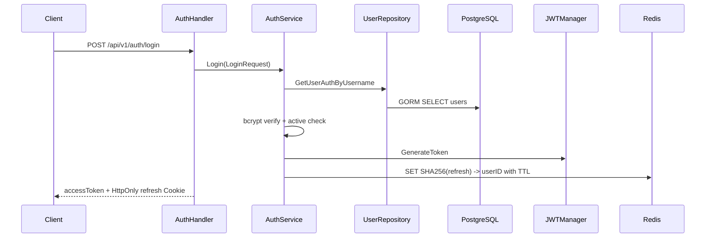
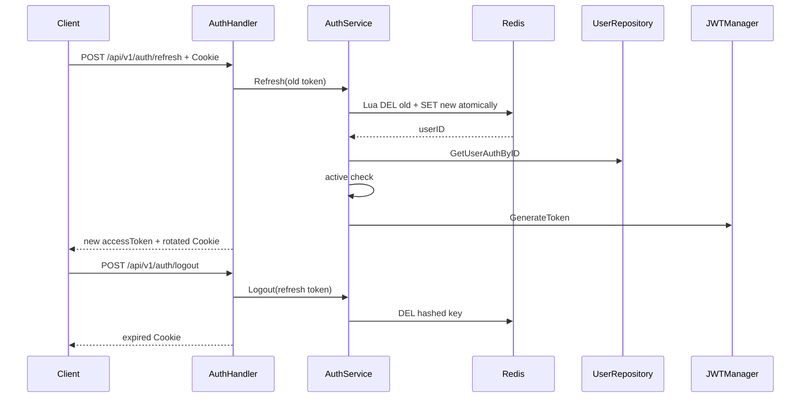

# AI Gateway Go V2 Architecture

本文描述 `rewrite/go-v2` 当前实际架构。Go module 位于 `backend/`，参考 `D:/vue-element-plus-admin/backend` 的模块化分层，但所有业务模块装配到同一个 API 进程；数据库 Repository 使用 GORM。

## 1. 运行拓扑



Compose stack 只有一个业务 API。Gateway 是无状态单上游代理，不持有身份或业务数据。当前没有 K8s 配置、微服务、gRPC、服务发现、JWKS、OIDC 或 OAuth。

## 2. 后端分层

```text
backend/cmd/api
  -> gin.Engine.Run
  -> internal/router.AuthRouter / UserRouter
       -> modules/auth/routes -> handler -> service
       -> modules/user/routes -> handler -> service -> repository
       -> middleware/jwt
       -> middleware/httpserver
  -> database/connect
  -> middleware/redis
```

启动约定对齐 `vue-element-plus-admin/backend/cmd/api/main.go`：

- `cmd/api` 只加载配置、连接 PostgreSQL/Redis、创建 `gin.Engine`、注册 `/ping` 与健康检查，然后调用 `AuthRouter`/`UserRouter`，最后 `router.Run(HTTP_ADDR)`；
- 不使用 `&http.Server` 管理 API 或 Gateway 生命周期；
- Handler 不在 `main` 创建，由 `internal/router` 组装 `NewService`、`New*Handler` 并调用模块 `Register*Routes`。

职责边界：

- Router：总路由和模块路由装配，并在此创建 Handler；
- Handler：JSON/Cookie/Gin Context 与 HTTP 状态；
- Service：登录、refresh 轮换、logout、用户状态规则；
- Repository：全部 GORM 用户表访问；
- JWT Middleware：Bearer token 验证和 Context 身份；
- Redis Middleware：refresh token 建立、原子轮换和删除；
- DTO：HTTP 合同，与 GORM model 分离。

分层不产生网络调用；Auth 与 User 都在同一 `cmd/api` 进程内。

## 3. 登录调用链



不存在的用户仍执行 dummy bcrypt。Redis 不存储或暴露原始 refresh token，只保存 `refresh_token:<sha256>` key。

## 4. Refresh 与 logout



规则：

- refresh token 是 32 字节安全随机值，以 Base64URL 传输；
- Cookie 为 HttpOnly、SameSite=Lax，Path 为 `/api/v1/auth`；
- `COOKIE_SECURE` 控制 Secure 属性，HTTPS 环境必须开启；
- rotation 使用 Redis Lua 原子完成，旧 token 只能成功使用一次；
- 无 Cookie 的 logout 视为已经注销，幂等返回成功；
- 用户删除或禁用后 refresh 失败；
- refresh token 状态不放入 PostgreSQL。

## 5. Access JWT 与当前用户

- 同一 API 使用本地 HMAC 密钥签发和验证 HS256 access token；
- 校验 issuer、audience、iat、exp、sub；
- claims 包含用户名、角色和预留 permissions；
- 不提供 JWKS；
- `/users/me` 和 `/auth/verify` 经 JwtFilter 后，通过 User Service/Repository 回查 PostgreSQL。

## 6. 数据和 readiness

PostgreSQL 只有最小 `users` 表：

```text
id, username, password_hash, role_code, is_active, created_at, updated_at
```

启动时 GORM `AutoMigrate`，初始化管理员使用 `FirstOrCreate`。API readiness 同时检查 PostgreSQL `PingContext` 和 Redis `PING`；任一依赖不可用即返回 `503`。

## 7. 仓库和部署边界

```text
repository root
├─ .env / .env.example
├─ docker-compose.yml
├─ backend/         # Go module + Dockerfile
├─ front/
└─ docs/
```

Docker build context 是 `./backend`。根 `.env` 只由根 Compose 自动读取；后端目录不放 `.env`。当前没有生产 Compose、K8s 或自动发布流程。

## 8. 当前能力边界

- 已实现：登录、access JWT、Redis refresh rotation、logout、当前用户、初始化管理员、readiness；
- 未实现：注册、改密、多设备会话管理、角色管理、细粒度权限、审计；
- 未实现：Provider、模型目录、Chat Completions、SSE、WebSocket；
- 未实现：API Key、限流、用量、钱包和计费。
