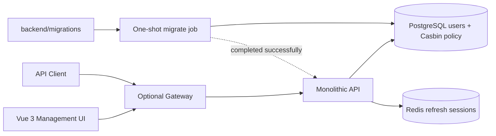
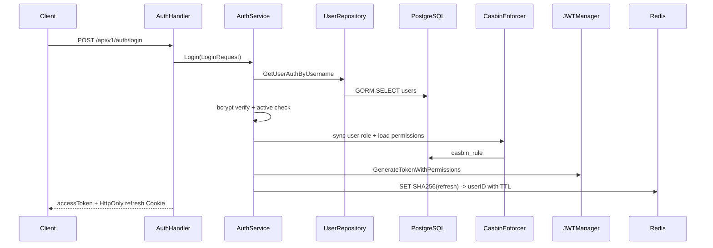
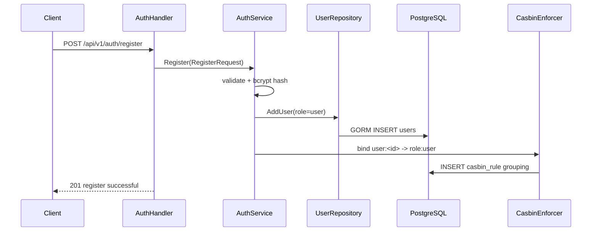
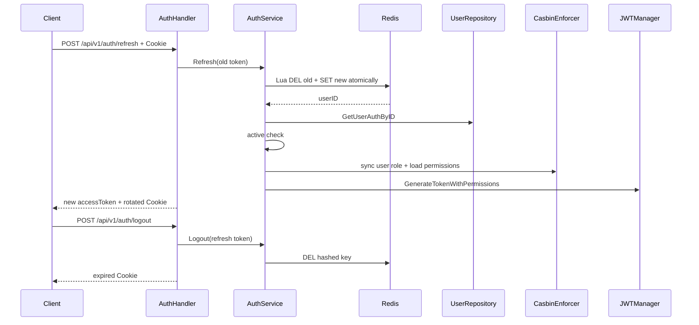

# AI Gateway Go V2 Architecture

本文描述 `rewrite/go-v2` 当前实际架构。Go module 位于 `backend/`，参考 `D:/vue-element-plus-admin/backend` 的模块化分层，但所有业务模块装配到同一个 API 进程；数据库 Repository 使用 GORM。

## 1. 运行拓扑



根 `docker-compose.yml` 定义名为 `ai-gateway-go-auth` 的独立 Stack，只有一个业务 API。Gateway 是无状态单上游代理，不持有身份或业务数据；`migrate` 是一次性 schema job。当前没有 K8s 配置、微服务、gRPC、服务发现、JWKS、OIDC 或 OAuth。

`front/` 是与 `backend/` 同级的独立 Vue 3 + Vite 单页管理界面。开发服务器把 `/api` 与 `/health` 代理到 `127.0.0.1:8080`；生产构建使用同源相对路径，需由与 Gateway 同源的静态服务承载。前端只消费后端公开 HTTP 合同，不直接访问 PostgreSQL 或 Redis。

## 2. 后端分层

```text
backend/cmd/api
  -> gin.Engine.Run
  -> internal/router.AuthRouter / UserRouter
       -> modules/auth/routes -> handler -> service
       -> modules/user/routes -> handler -> service -> repository
       -> middleware/jwt
       -> middleware/casbin
       -> middleware/httpserver
  -> database/connect
  -> middleware/redis
```

启动约定对齐 `vue-element-plus-admin/backend/cmd/api/main.go`：

- Compose 先等待 PostgreSQL healthy，再执行全部未应用的 SQL migration；只有 `migrate` 成功退出后才启动 API；
- `cmd/api` 加载配置，连接已迁移的 PostgreSQL/Redis，初始化 User Repository、Casbin Enforcer 和 JWT Manager，创建 `gin.Engine`、注册 `/ping` 与健康检查，然后调用 `AuthRouter`/`UserRouter`，最后 `router.Run(HTTP_ADDR)`；
- API 直接通过 Gin Engine 的 `router.Run(HTTP_ADDR)` 启动；Gateway 仍使用标准库 `http.Server` 承担反向代理；
- Handler 不在 `main` 创建，由 `internal/router` 组装 `NewService`、`New*Handler` 并调用模块 `Register*Routes`。

职责边界：

- Router：总路由和模块路由装配，并在此创建 Handler；
- Handler：JSON/Cookie/Gin Context 与 HTTP 状态；
- Service：登录、refresh 轮换、logout、用户状态规则；
- Repository：全部 GORM 用户表访问；
- JWT Middleware：Bearer token 验证和 Context 身份；
- Casbin Middleware：GORM policy persistence、用户角色同步和有效权限计算；
- Redis Middleware：refresh token 建立、原子轮换和删除；
- DTO：HTTP 合同，与 GORM model 分离。

依赖接口遵循使用方定义原则：Repository 是具体的 GORM 实现，Auth/User Service 直接依赖 `*user.Repository`；需要隔离 HTTP 层时，由 Handler 定义最小 Service 接口，例如 `CurrentUserService`。Repository 文件不声明只为测试替身服务的接口。

分层不产生网络调用；Auth 与 User 都在同一 `cmd/api` 进程内。

## 3. 登录调用链



不存在的用户仍执行 dummy bcrypt。Redis 不存储或暴露原始 refresh token，只保存 `refresh_token:<sha256>` key。

浏览器端由 Vue Router 保护首页路由。登录页调用 `/api/v1/auth/login`，根据“记住登录状态”把 access token 保存到 `localStorage` 或 `sessionStorage`，refresh token 始终仅存在于后端设置的 HttpOnly Cookie 中。首页通过 Bearer access token 请求 `/api/v1/users/me`；遇到 `401` 时先调用 `/api/v1/auth/refresh` 轮换 Cookie 并重试一次，仍失败则清理 access token 并返回登录页。前端不读取 refresh token。

## 4. 注册调用链



客户端必须提交 `username`、`password`、`check_password`、非空 `code` 和 `iAgree=true`。用户名为 3–50 个字符，密码为 8–72 字节；客户端不能指定角色，所有注册用户固定为 `user`。当前验证码只复用原后端的“非空检查”阶段，没有验证码发送或真实性校验服务。

Vue 登录页提供“创建账号”入口并导航到 `/register`。注册页在客户端先检查用户名长度、密码长度与一致性、非空注册码及使用确认，再调用注册接口；`201` 成功后不建立登录会话，而是返回 `/login`、回填新用户名并显示成功提示。`400` 和 `409` 分别映射为表单校验与用户名重复反馈。

## 5. Refresh 与 logout



规则：

- refresh token 是 32 字节安全随机值，以 Base64URL 传输；
- Cookie 为 HttpOnly、SameSite=Lax，Path 为 `/api/v1/auth`；
- `COOKIE_SECURE` 控制 Secure 属性，HTTPS 环境必须开启；
- rotation 使用 Redis Lua 原子完成，旧 token 只能成功使用一次；
- 无 Cookie 的 logout 视为已经注销，幂等返回成功；
- 用户删除或禁用后 refresh 失败；
- refresh token 状态不放入 PostgreSQL。

## 6. Access JWT 与当前用户

- 同一 API 使用本地 HMAC 密钥签发和验证 HS256 access token；
- `JWT_SECRET` 必须由根 `.env` 提供，代码和 Compose 都不提供开发默认密钥；
- 校验 issuer、audience、iat、exp、sub；
- claims 包含用户名、Casbin 角色和有效 permissions；
- 不提供 JWKS；
- `/users/me` 和 `/auth/verify` 经 JwtFilter 后，通过 User Service/Repository 回查 PostgreSQL，再由 Casbin 返回有效角色和权限。

当前 Casbin 模型是最小 RBAC：用户 subject 为 `user:<id>`，角色 subject 为 `role:<code>`。仅支持 `user`、`admin`、`test`，三者都只有 `dashboard:view` 权限；暂不提供角色或策略管理 API。

## 7. 数据和 readiness

PostgreSQL 当前包含最小 `users` 表：

```text
id, username, password_hash, role_code, is_active, created_at, updated_at
```

数据库结构只由 `backend/migrations` 管理：`000001_users` 创建用户表，`000002_casbin_rbac` 创建 `casbin_rule` 并写入三角色首页策略；migrate 工具在 `schema_migrations` 记录当前版本和 dirty 状态。生产 API 与 Casbin GORM Adapter 都关闭自动迁移，初始化管理员仍使用 `FirstOrCreate`。测试可在隔离的内存 SQLite 上使用 `AutoMigrate`，不影响生产 schema 流程。API readiness 同时检查 PostgreSQL `PingContext` 和 Redis `PING`；任一依赖不可用即返回 `503`。

## 8. 仓库和部署边界

```text
repository root
├─ .env / .env.example
├─ docker-compose.yml
├─ backend/         # Go module + Dockerfile + migrations
├─ front/           # Vue 3 + Vite management UI
└─ docs/
```

Docker build context 是 `./backend`，migration job 只读挂载 `./backend/migrations`。根 `.env` 只由根 Compose 自动读取；后端目录不放 `.env`。`.scripts/update-database.sh` 是“启动 PostgreSQL 后运行既有 migrate job”的本地快捷入口；`.scripts/start-frontend.sh` 依次执行现有 Compose 后端启动流程与 Vite 开发服务器，`Ctrl+C` 只终止前台 Vite 进程，不停止后端容器。这两个脚本都不改变上述部署边界。当前没有生产 Compose、K8s 或自动发布流程。

## 9. 当前能力边界

- 已实现：Vue 3 登录页与受保护首页、登录后跳转、access token 会话恢复、自动 refresh 重试、退出登录、响应式导航和明暗主题；
- 已实现：后端注册、登录、access JWT、Redis refresh rotation、logout、当前用户、初始化管理员、Casbin 三角色首页权限、readiness；
- 未实现：真实验证码服务、改密、多设备会话管理、角色/策略管理、细粒度业务权限、审计；
- 未实现：Provider、模型目录、Chat Completions、SSE、WebSocket；
- 未实现：API Key、限流、用量、钱包和计费。
