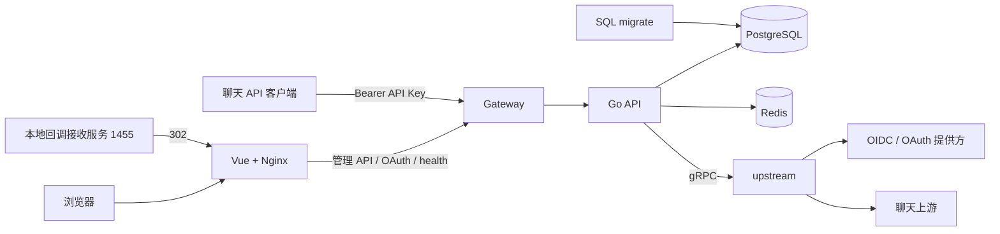

# erent 项目架构

本项目采用 Vue 管理控制台、Go 模块化 API、无状态 Gateway 和独立 upstream gRPC 服务。数据库访问使用 GORM，表结构由 SQL migration 管理。本地部署步骤见 [根 README](../README.md)。

## 运行拓扑



| 组件 | 职责 |
| --- | --- |
| `frontend/` | Vue 3、Vite、Axios；登录注册、授权账号、API Key 管理；Nginx 提供生产静态文件 |
| `backend/cmd/gateway` | Gin 入口和 HTTP 反向代理，不保存业务数据；默认宿主机 8080 |
| `backend/cmd/api` | 配置加载、资源初始化、路由和业务装配；认证、用户、OAuth、API Key、聊天转发 |
| `backend/cmd/upstream` | gRPC 服务，执行 OIDC discovery / JWKS、OAuth 兑换与刷新、设备授权以及聊天 HTTP 请求 |
| PostgreSQL | 用户、Casbin 策略、加密 OAuth 凭据、API Key 哈希和账号关联 |
| Redis | 本地 refresh 会话、OAuth state 和设备授权会话 |
| `backend/migrations/` | 一次性迁移任务，成功后 API 才启动 |
| `backend/docker-compose.callback.yml` | 浏览器所在电脑的回环地址 1455 回调接收服务 |

本地 Compose 只向回环地址发布 Web 8088、Gateway 8080、PostgreSQL 5432 和回调 1455；API、Redis、upstream 通过容器网络通信。API 与 upstream 的轮转日志分别使用持久化 volume。

## 代码分层

```text
cmd/api → internal/router → modules/* routes → handler → service → repository
                                                    → directory/upstream → gRPC
cmd/upstream → internal/upstreamserver → 外部 HTTP 服务
```

- `cmd/api` 负责进程生命周期、配置、依赖装配和健康检查。
- `internal/router` 创建各模块 Service / Handler 并注册路由。
- Handler 处理 HTTP、JSON、Cookie 与请求上下文；Service 编排业务；Repository 负责 GORM 查询与事务内更新。
- `internal/directory/upstream` 持有 gRPC client，转换消息、OAuth 错误及请求期限。
- `internal/modules/translator` 转换聊天请求、流事件和非流式结果；`chat/route` 按模型、凭据模式和客户端格式选择目标。
- `internal/rpc/upstream` 是从 `backend/proto/upstream.proto` 生成的协议代码。
- `internal/security` 使用 AES-GCM 加密和解密 OAuth 凭据。

## 本地身份与会话

注册创建固定 `user` 角色。密码使用 bcrypt；登录后签发本地 HS256 access JWT，并通过 HttpOnly、SameSite=Lax Cookie 保存 refresh token。Redis 仅保存 refresh token 的 SHA-256 索引，刷新通过 Lua 原子轮换；注销删除会话。前端共享一次并发 refresh 请求，并最多重试原请求一次。

Casbin 策略保存在 PostgreSQL，目前 `user`、`admin`、`test` 均具有 `dashboard:view`。本地 JWT 不提供 JWKS；外部 OIDC 的验签由 upstream 获取提供方 JWKS 完成。注册中的验证码目前只检查非空，没有真实发送或验证服务。

## 授权流程

浏览器流程：控制台携带本站 JWT 获取授权 URL；API 生成 state、nonce、PKCE verifier 并保存到 Redis。回调原子消费 state，经 upstream 兑换和验签，再校验 nonce 与账号身份，使用 `OAUTH_ENCRYPTION_KEY` 加密后绑定当前用户保存。HTML 回调成功通过 303 跳转 `/authorized-accounts`，JSON 请求返回保存结果，不返回上游 token。

设备流程：控制台申请设备码并发起一次可取消的完成请求；API 将设备会话绑定到用户，在完成请求中校验归属并一次性消费，再经 upstream 轮询、兑换和保存。轮询最长 15 分钟；前端、Nginx 和 Gateway 对完成路径设置 16 分钟等待。取消或超时后需先检查账号是否已经保存。

本地浏览器回调可使用 `http://localhost:1455/auth/callback`。接收服务只监听浏览器电脑的回环地址，通过 302 转交固定 `OAUTH_CONSOLE_ORIGIN` 的 `/oauth/callback`，禁用回调日志与缓存。完整 Compose 默认返回 Web 8088，开发脚本返回 Vite 5173。配置必须与提供方登记的地址以及 API/upstream 两端保持一致。

账号列表仅返回当前用户的元数据。手动刷新通过 PostgreSQL 行锁串行读取和更新凭据；缺失的新 refresh/ID token 保留旧值。删除只删除本地记录，不撤销提供方授权。当前没有后台自动刷新。

## API Key 与聊天

API Key 由安全随机数生成，仅创建时返回完整密钥；数据库保存 SHA-256 哈希和展示前缀。创建与替换关联均验证账号归属；复合外键防止跨用户绑定。支持列表、有效期、禁用、账号替换和删除。

```text
聊天请求 → ApikeyFilter（密钥、模型、关联账号校验）
         → GetCredential（首个账号、状态、有效期、解密）
         → ChatService → route → translator → Directory
         → upstream ChatStream / ChatNonStream → 外部聊天服务
         → 格式转换 → 客户端 SSE 或 JSON
```

当前路由表注册 Codex access token 模式；上游强制使用流时，非流式客户端请求由 API 聚合最终结果再转换。流式响应首包前失败返回 HTTP 错误；首包后失败输出流内错误。客户端取消会传递到 gRPC 和上游 HTTP。当前只选择首个关联账号，没有失败切换或轮询负载均衡。

### 当前 HTTP 接口

| 方法 | 路径 | 认证 / 用途 |
| --- | --- | --- |
| POST | `/api/v1/auth/login`、`/register`、`/refresh`、`/logout`（后三项沿用 `/api/v1/auth` 前缀） | 本地会话 |
| GET | `/api/v1/users/me`、`/api/v1/auth/verify` | 本站 JWT |
| GET / POST | `/api/v1/api-keys` | 本站 JWT，列表 / 创建 |
| PATCH / DELETE | `/api/v1/api-keys/:id` | 本站 JWT，修改状态或有效期 / 删除 |
| PUT | `/api/v1/api-keys/:id/accounts` | 本站 JWT，替换关联账号 |
| GET | `/oauth/login`、`/oauth/list` | 本站 JWT |
| GET | `/oauth/callback` | 一次性 state 绑定用户 |
| POST | `/oauth/logindevice`、`/oauth/callbackdevice`、`/oauth/refresh`、`/oauth/delete` | 本站 JWT |
| POST | `/chat/completions`、`/v1/response`、`/v1/messages` | Bearer API Key，分别为 Chat Completions / Responses / Claude 格式 |
| GET | `/health/live`、`/health/ready` | 存活 / 就绪 |

聊天路径直接挂载在根路由，不带 `/api/v1` 前缀，Responses 路径当前为单数。Web Nginx / Vite 仅代理管理 API、OAuth 和健康接口；聊天客户端通过 Gateway 入口请求上述实际路径。

## 持久化与运行边界

| 迁移 | 内容 |
| --- | --- |
| 000001 | `users` |
| 000002 | `casbin_rule` 与基础角色策略 |
| 000003 | `oauth_infos` |
| 000004 | OAuth 用户归属、级联外键及账号唯一约束 |
| 000005 | `api_keys`、`api_key_accounts` 与用户一致性约束 |

生产 API 不执行自动建表，migrate 使用 `schema_migrations` 记录版本与 dirty 状态。OAuth 加密密钥必须随数据库持久保管。测试可使用隔离 SQLite，不能代替生产 PostgreSQL migration。

API readiness 检查 PostgreSQL 和 Redis，启用 OAuth 时额外检查 upstream 服务健康；该探针不保证外部提供方实时可用。upstream 不连接数据库和 Redis。API 始终创建 gRPC client，OAuth 禁用时不做 provider 初始化。

普通 OAuth RPC 默认 10 秒，设备等待使用独立期限；聊天流继承请求上下文。跨主机 gRPC 支持 mTLS：每个进程设置 `UPSTREAM_GRPC_TLS_CA_FILE`、`UPSTREAM_GRPC_TLS_CERT_FILE`、`UPSTREAM_GRPC_TLS_KEY_FILE`，API 可配置 `UPSTREAM_GRPC_TLS_SERVER_NAME`。本地 Compose 默认使用容器内明文 gRPC；跨主机需在部署配置中挂载证书并传入变量。

## 构建与发布

CI 验证 Go、Vue 和镜像构建。`release.yml` 在 `main` push、`v*` tag 或手动触发时发布 API、Gateway、upstream、migrations、Web 五个 GHCR 镜像，附加完整源码 SHA；标签事件还生成对应版本标签。各服务应使用相同源码版本，生产部署配置、凭据和服务器信息由独立部署环境维护。推送版本标签会触发镜像发布，镜像可用性以工作流结果为准。

## 当前未实现能力

- 后台自动刷新、账号失败切换与负载均衡。
- 真实验证码、改密、角色策略管理和审计。
- 动态 provider / 模型管理、WebSocket。
- 限流、用量统计、钱包与计费。
